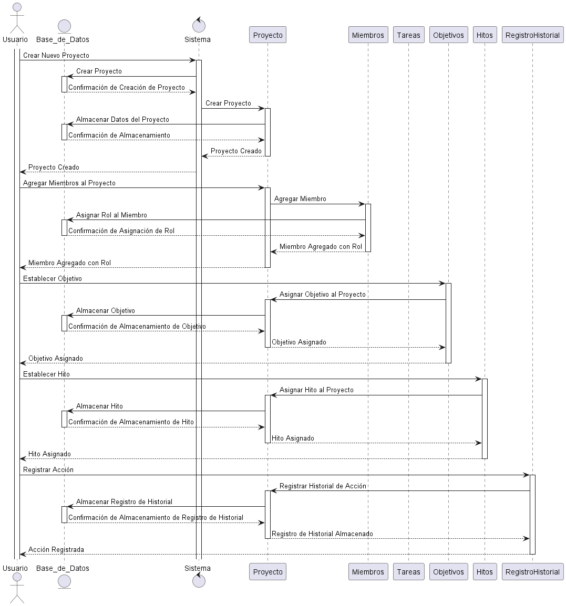

# Ejercicio 3: Sistema de Gestión de Proyectos

Este sistema de gestión de proyectos tiene como objetivo facilitar la organización, control y seguimiento de proyectos de forma eficiente. Permite a los usuarios crear y asignar tareas dentro de cada proyectos, así como gestionar tareas, asignarlas a miembros del equipo, establecer fechas límite, definir objetivos y hitos claves del proyecto

## [Diagrama de Clases](Diagrama/Diagrama_Clases.wsd)

## [Diagrama de Secuencia](Diagrama/Diagrama_Secuencia.wsd)

## [Diagrama de Casos de Uso](Diagrama/Diagrama_Casos.wsd)

